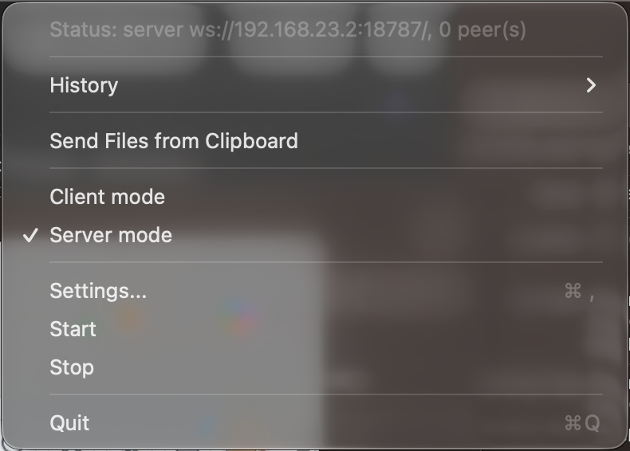
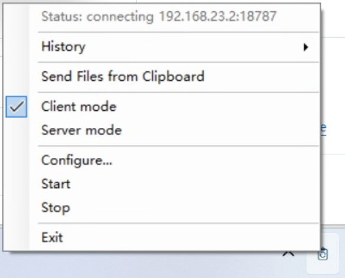

# Clipboard Sync

Native, password-protected clipboard sync for macOS, Windows, and Linux. The app runs in the menu bar or system tray and does not require an account or a hosted cloud dashboard. The Linux Qt 6 client supports text, image and explicit clipboard-file transfer, port forwarding, and keyboard/mouse input sharing with the shared screen layout on X11 sessions; Wayland sessions detect but do not yet offer input sharing.

## Getting connected

1. Install Clipboard Sync on both devices. The macOS build requires macOS 13 or later; the Windows installer targets 64-bit Windows 10/11; Linux requires Qt 6.7+ or the KDE 6.9 Flatpak runtime.
2. Choose **Server** on one device. Configure the other devices as **Child Device** using the shown LAN address and the same password.
3. Copy and paste normally. Text and images sync automatically.

Files remain an explicit clipboard workflow: copy files in Finder or Explorer, choose **Send Files from Clipboard**, select the destination device, then paste received files wherever you want to keep them.

## Key features

1. Clipboard sync over LAN or another trusted routed connection you configure.
2. Automatic text and image sync.
3. Explicit file transfer from the clipboard.
4. Clipboard history with image thumbnails and timestamps.
5. Password-protected payloads.
6. Mouse and keyboard sharing with a visual screen layout.
7. Advanced TCP port forwarding between connected devices.

The ordinary menu focuses on connection status, clipboard tasks, input sharing, and pausing/resuming sync. The work mode is selected only in Settings. Port forwarding and launch-at-login live under **More Features**. First launch opens Settings automatically; incomplete configuration remains actionable from the status row.





## Run Linux

The Linux client requires Qt 6.7+, OpenSSL 3, CMake 3.24+, and Ninja. Build and
run it with:

```sh
cmake -S linux -B linux/build -G Ninja -DCMAKE_BUILD_TYPE=Release
cmake --build linux/build
ctest --test-dir linux/build --output-on-failure
./linux/build/clipboard-sync
```

See [linux/README.md](linux/README.md) for desktop capability and update-channel details.
