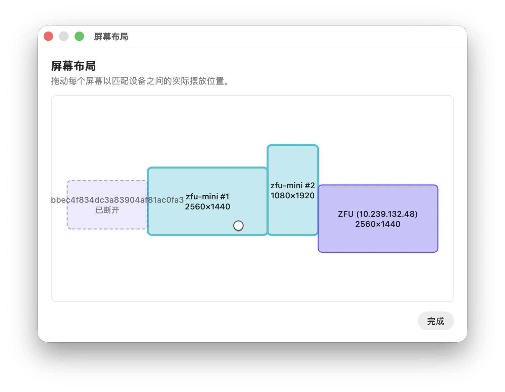
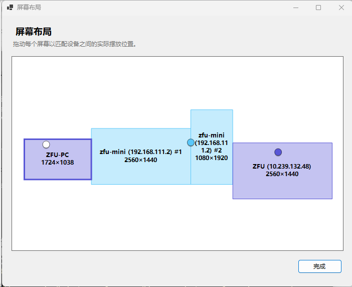
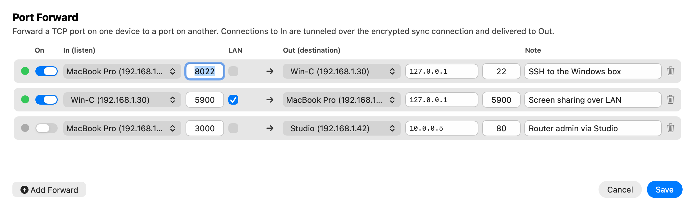

# Clipboard Sync

**Your clipboard, everywhere on your LAN.**

A lightweight native app that syncs text, images, and files across your Mac, PC, and Linux box —
and lets you share one mouse and keyboard between them.
Instant, encrypted, and without the cloud.

[**Website**](https://clipboardsync.fuzhuo.me) · [**Downloads**](https://clipboardsync.fuzhuo.me/#download) · [**Releases**](https://github.com/qiudaomao/clipboardSync/releases) · [**Report an issue**](https://github.com/qiudaomao/clipboardSync/issues)

macOS 13+ · 64-bit Windows 10/11 · Linux (Flatpak) — free &amp; open source, no account required.

---

## ✨ Highlights

- 🔄 **LAN clipboard sync** — copy on one machine, paste on another, instantly.
- 🖼️ **Text & images** — synced automatically, no manual steps.
- 📁 **Click-to-sync files** — copy files, choose *Send Files from Clipboard*, paste on the other device.
- 🖱️ **Mouse & keyboard sharing** — one mouse and keyboard for all machines, with a drag-based screen layout.
- 🎯 **Auto control device** — control follows whichever physical mouse or trackpad you touched last; keyboard activity never switches it, so a mouse on one machine and a keyboard on another just work.
- 🚇 **Port forwarding** — tunnel SSH, VNC, or a dev server between devices over the same encrypted connection.
- 🕓 **Clipboard history** — browse and reuse recent clipboard items with thumbnails.
- 🔐 **Private by design** — password-authenticated, encrypted payloads; no account, no cloud.
- ⚡ **Fully native** — Swift on macOS, C# on Windows, Qt/C++ on Linux. No Electron.
- ⟳ **Auto-updates** — built in on all three platforms.

## 🖥️ Preview

| macOS | Windows |
|:--:|:--:|
|  |  |

 
Built-in port forwarding: reach a service on any of your devices as if it were local.

## 🆚 Compared with Synergy

Everything Synergy does, plus the clipboard-first features it doesn't:

| Feature | Clipboard Sync | Synergy |
|---|:--:|:--:|
| Mouse & keyboard sharing | ✅ | ✅ |
| Drag-based screen layout | ✅ | ✅ |
| Encrypted transport | ✅ | ✅ |
| Clipboard text sync | ✅ | ✅ |
| Clipboard image sync | ✅ | Limited |
| File transfer | ✅ from the clipboard | Limited |
| Clipboard history with thumbnails | ✅ | ❌ |
| **Auto control device** — control follows your physical mouse | ✅ | ❌ |
| TCP port forwarding between devices | ✅ | ❌ |
| Prevent system sleep (timers & weekly time plan) | ✅ | ❌ |
| Price | Free & open source | Paid license |

## 🚀 Connected in three steps

1. **Install on your devices** — grab it from [clipboardsync.fuzhuo.me](https://clipboardsync.fuzhuo.me/#download) or [GitHub Releases](https://github.com/qiudaomao/clipboardSync/releases).
2. **Pick a server** — choose **Server** on one device, then connect the others as **Child Devices** with the shown LAN address and a shared password.
3. **Copy and paste** — text and images sync automatically; files go over with *Send Files from Clipboard*.

## 🛠️ Open source

Clipboard Sync is open source. Build it yourself, poke at the protocol, or send a fix:

- [Building from source](docs/Build.md) — macOS, Windows, and Linux
- [Wire protocol](docs/protocol.md) — the shared WebSocket message contract
- [Linux client details](linux/README.md) — Flatpak, updates, X11/Wayland notes
- [Release guides](docs/release_all.md) — how releases and auto-update feeds are published

---

© 2026 · dev with ❤️ by <a href="https://x.com/droidfu">Zhuo Fu</a>

